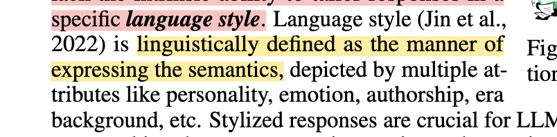
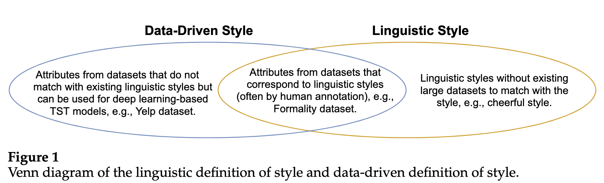
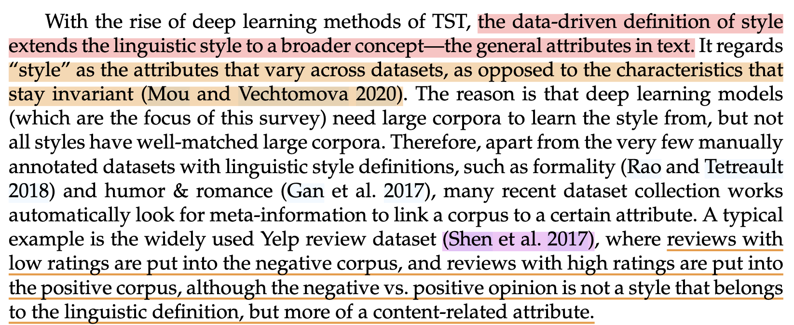
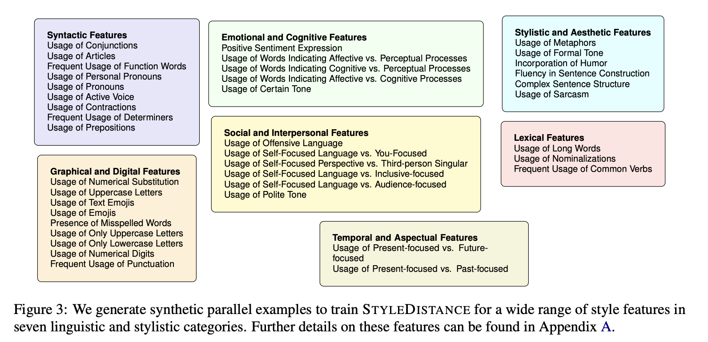
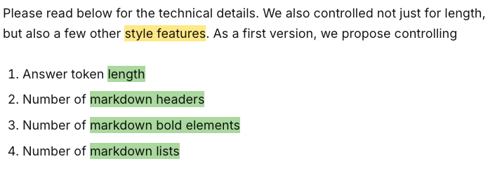

If too much work to add here, feel free to use [this google doc](https://docs.google.com/document/d/1tivKXEYjWe2pOe6xe4t2LQPZmn_cSsLsae0riU2VBCE/edit?tab=t.0#heading=h.deietoojezvo)

[DRESSing Up LLM: Efficient Stylized Question-Answering via Style Subspace Editing](https://arxiv.org/abs/2501.14371)

[Deep Learning for Text Style Transfer: A Survey](https://direct.mit.edu/coli/article/48/1/155/108845/Deep-Learning-for-Text-Style-Transfer-A-Survey)

- **LISA** - https://arxiv.org/abs/2305.12696
  - What is style? *Stylistic attributes have included, but are not limited to, linguistic choices in syntax, grammar, spelling, vocabulary, and punctuation*
- **Topic-Regularized Authorship Representation Learning -** **https://www.semanticscholar.org/paper/Topic-Regularized-Authorship-Representation-Sawatphol-Chaiwong/9751274d247da029a7812f98bda13e87beb43ed2**
  - What is style? **-** *an embedding that can be used to compare writing style similarity with minimum topic influence.*
- **Disentangled Representation Learning for Non-Parallel Text Style Transfer** - **https://arxiv.org/abs/1808.04339**
  - What is style? **-** *In this work, we consider the sentiment of a sentence as the style.*
- **PART: Pre-trained Authorship Representation Transformer** - **[https://www.semanticscholar.org/paper/PART%3A-Pre-trained-Authorship-Representation-Huertas-Tato-Huertas-Garc%C3%ADa/9ea973ed64328da31f1f818bf554d6605504cbb0](https://www.semanticscholar.org/paper/PART%3A-Pre-trained-Authorship-Representation-Huertas-Tato-Huertas-García/9ea973ed64328da31f1f818bf554d6605504cbb0)**
  - **What is style? -** *We name this representation of writing style authorship embedding. Whereas semantic embeddings generated by transformers detect contextual and semantic features focusing on the content of the text, authorship embeddings are meant to encode features (from context and semantics too) from the author of the text, shifting the focus of the transformer towards style.*
- **Counterfactual Augmentation for Robust Authorship Representation Learning -** **https://www.semanticscholar.org/paper/Counterfactual-Augmentation-for-Robust-Authorship-Man-Nguyen/4af5a35875bd330ec566108fed8b381f416d090e**
  - What is style? - *Content-counterfactuals hide topic content to encourage focusing on writing style*
- **Challenging Assumptions in Learning Generic Text Style Embeddings** - **https://www.semanticscholar.org/paper/Challenging-Assumptions-in-Learning-Generic-Text-Ostheimer-Kloft/cc9f8f9a198473f5d67f70b437ac876920bcbf8b**
  - What is style? **-** *Generic style representations incorporating low-level aspects such as lexical, syntactic, semantic, and thematic stylistic traits (McDonald and Pustejovsky, 1985; DiMarco and Hirstt, 1993) but also high-level, composed stylistic traits might significantly improve style-focused tasks. Based on the hypothesis that low-level style changes compose high-level style changes, this work explores learning generic, sentence-level style representations.*
- **StyleRemix: Interpretable Authorship Obfuscation via Distillation and Perturbation of Style Elements -** **https://www.semanticscholar.org/paper/StyleRemix%3A-Interpretable-Authorship-Obfuscation-of-Fisher-Hallinan/12a52a817bf1495d872cfde09ce071c1a995ba3d**
  - What is style? - *When selecting the style axis, our goal is to identify “author invariants”, which are text properties that are unique to a specific author. The widely accepted author invariants in the field of stylometry (the study of authorship style) include text length and the use of function wordsAdditionally, we incorporate "grade level," which primarily measures discrete features like the number of syllables and sentence and word lengths. Since this measure can vary slightly, we averaged three similar metrics: the Flesch-Kincaid (FK; Flesch, 1948), Linsear Write (L; O’Hayre), and the Gunning Fog Index (GF; Gunning, 1952) metrics. For the exact formulas, see Appendix C.1. Beyond formula-based properties, we also explore more abstract style axes such as the use of sarcasm, formality, voice (passive or active), and writing type (persuasive, descriptive, narrative, and expository). Due to the lack of existing formulas, we train model-based classifiers to measure these properties*
- **StyleFlow: Disentangle Latent Representations via Normalizing Flow for Unsupervised Text Style Transfer -** **https://www.semanticscholar.org/paper/StyleFlow%3A-Disentangle-Latent-Representations-via-Zhu-Tian/5ce045828b065d0e7638e75fbab1b7a1e5a7c6c7**
  - Sentiment and formality
- **StAyaL | Multilingual Style Transfer** - https://arxiv.org/pdf/2501.11639
  - What is style? — *However, these methods often overlook the subtleties of speech style, such as tone, rhythm, and linguistic choices, treating it as ancillary to content.*
- **StyleDistance** - https://arxiv.org/abs/2410.12757
  - What is style? - *For this work, we select 40 style features across 7 broad categories (visualized in Figure 3) which have been addressed in different works on text style (Tausczik and Pennebaker, 2010; Kang and Hovy, 2019; Wegmann and Nguyen, 2021; Jin et al., 2022; Patel et al., 2023). Specifically, we select features for which it is possible to generate both positive and negative examples (e.g., formal/informal, passive/active voice).*
  - 

https://news.lmarena.ai/style-control/)

- **Disentangling Style Factors from Speaker Representations** [Williams & King 2019](https://www.pure.ed.ac.uk/ws/portalfiles/portal/369352486/williams19c_interspeech.pdf)
  - "This paper adopts a working definition of style to be: how speakers adapt their speaking manner according to the speaking context. In this work we investigate four categories of speaking style: spontaneous conversation, goal-directed interaction, retold passage, and read passage. In separate experiments on other data, we also explore four basic categories of emotion: angry, happy, sad, and neutral."
